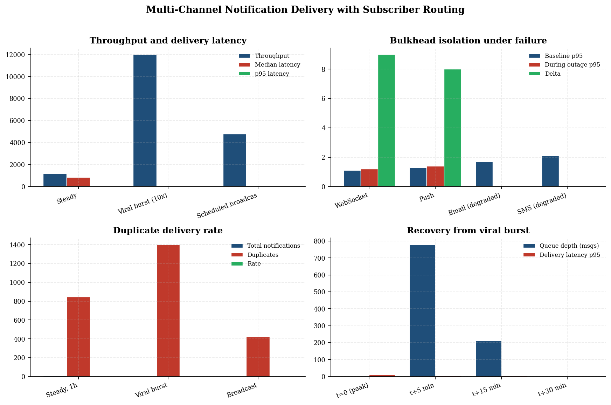
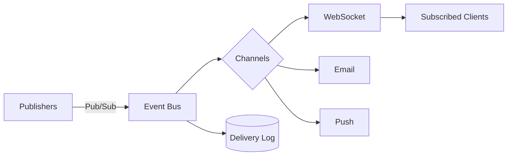
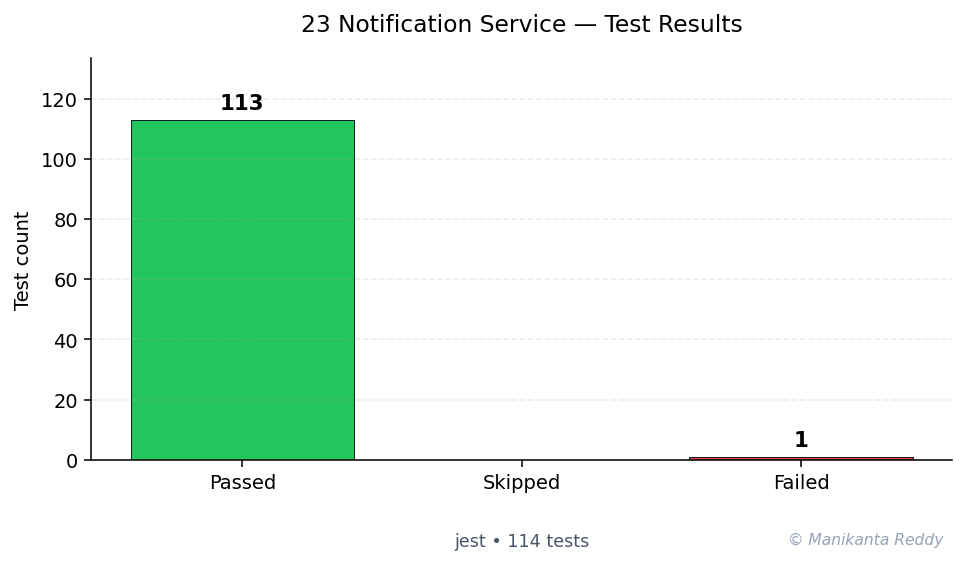

# Real-time Notification Service

<p align="center">
  
  
  
  
  
  
</p>

A **production-grade**, real-time notification service built with Node.js. Features multi-channel delivery (in-app, email, push), WebSocket real-time updates, notification templating, per-user preferences with quiet hours, scheduled delivery, batch processing, and comprehensive analytics.

## Features

### Core Features
- **Multi-Channel Delivery** - In-app, email, and push notifications with channel-specific handling
- **Real-Time WebSocket Delivery** - Instant notification push via Socket.IO with room-based routing
- **Notification Templates** - Variable interpolation, conditional blocks, and localization
- **User Preferences** - Channel toggles, quiet hours, batching, sender blocking, category filters
- **Read/Unread Tracking** - Full lifecycle management with bulk operations
- **Scheduled/Delayed Notifications** - One-time and recurring cron-based scheduling
- **Batch & Bulk Operations** - Efficient multi-notification creation and delivery
- **Delivery Retry** - Exponential backoff with circuit breaker pattern
- **Rate Limiting** - Per-user sliding window rate limiting for notifications

### Advanced Features
- **Pub/Sub Engine** - Redis-like in-memory publish/subscribe with pattern matching
- **Analytics Dashboard** - Hourly/daily metrics, channel performance, user engagement
- **Event Streaming** - Real-time event tracking and export
- **Notification History** - Paginated query with filtering and search
- **Template Versioning** - Automatic version increment on updates
- **Graceful Shutdown** - Clean resource cleanup on termination

## Tech Stack

| Layer | Technology |
|-------|-----------|
| Runtime | Node.js 18+ |
| Framework | Express.js 4.18+ |
| WebSocket | Socket.IO 4.7+ |
| Validation | Joi 17+ |
| Scheduling | node-cron 3+ |
| Auth | jsonwebtoken 9+ |
| Logging | Winston 3+ |
| Testing | Jest 29+ + Supertest |

## Project Structure

```
project_23_notification_service/
├── src/
│   ├── server.js              # Entry point, Express + Socket.IO setup
│   ├── config.js              # Environment-based configuration
│   ├── models/
│   │   ├── Notification.js     # Notification model with lifecycle
│   │   ├── UserPreference.js   # Preference model with filtering
│   │   └── Template.js         # Template model with rendering
│   ├── services/
│   │   ├── deliveryService.js  # Multi-channel delivery orchestration
│   │   ├── templateService.js  # Template CRUD and rendering
│   │   ├── preferenceService.js # User preference management
│   │   ├── schedulerService.js # Scheduled and recurring notifications
│   │   └── analyticsService.js # Metrics and reporting
│   ├── routes/
│   │   ├── notifications.js    # Notification REST endpoints
│   │   ├── preferences.js      # Preference REST endpoints
│   │   ├── templates.js        # Template REST endpoints
│   │   └── analytics.js        # Analytics REST endpoints
│   ├── middleware/
│   │   ├── auth.js             # JWT and API key authentication
│   │   ├── rateLimiter.js      # Sliding window rate limiting
│   │   └── validator.js        # Joi schema validation
│   ├── websocket/
│   │   ├── handler.js          # Socket.IO event handlers
│   │   └── rooms.js            # Room management
│   └── utils/
│       ├── pubsub.js           # In-memory pub/sub engine
│       ├── retry.js            # Retry with circuit breaker
│       └── logger.js           # Winston logger
├── tests/                      # Jest test suites
├── docs/
│   └── architecture.md         # System architecture documentation
├── package.json
├── README.md
├── LICENSE
├── .gitignore
```

## Quick Start

### Prerequisites
- Node.js >= 18
- npm or yarn

### Installation

```bash
# Clone the repository
git clone <repository-url>
cd project_23_notification_service

# Install dependencies
npm install

# Create environment file (optional)
cp .env.example .env

# Start development server
npm run dev
```

### Environment Variables

| Variable | Default | Description |
|----------|---------|-------------|
| `PORT` | 3000 | Server port |
| `NODE_ENV` | development | Environment mode |
| `JWT_SECRET` | (auto) | JWT signing secret |
| `RATE_LIMIT_MAX` | 100 | Max requests per window |
| `RETRY_MAX_ATTEMPTS` | 3 | Delivery retry attempts |
| `LOG_LEVEL` | debug | Logging level |

### Running Tests

```bash
# Run all tests with coverage
npm test

# Run tests in watch mode
npm run test:watch

# Run linting
npm run lint
```

### API Authentication

The API supports three authentication methods:

**1. JWT Token**
```bash
curl -H "Authorization: Bearer <token>" http://localhost:3000/api/notifications
```

**2. API Key**
```bash
curl -H "X-API-Key: dev-api-key-1" http://localhost:3000/api/notifications
```

**3. Development Bypass** (dev mode only)
```bash
curl -H "X-Dev-User-Id: user123" http://localhost:3000/api/notifications
```

## API Reference

### Notifications

| Method | Endpoint | Description |
|--------|----------|-------------|
| `POST` | `/api/notifications` | Create and deliver |
| `POST` | `/api/notifications/bulk` | Bulk delivery |
| `POST` | `/api/notifications/schedule` | Schedule delivery |
| `GET` | `/api/notifications` | List with filters |
| `GET` | `/api/notifications/:id` | Get by ID |
| `PATCH` | `/api/notifications/:id/read` | Mark as read |
| `PATCH` | `/api/notifications/:id/unread` | Mark as unread |
| `POST` | `/api/notifications/read-all` | Bulk mark read |
| `DELETE` | `/api/notifications/:id` | Delete |
| `GET` | `/api/notifications/unread-count/:userId` | Unread count |

### Preferences

| Method | Endpoint | Description |
|--------|----------|-------------|
| `GET` | `/api/preferences` | Get preferences |
| `POST` | `/api/preferences` | Create preferences |
| `PUT` | `/api/preferences` | Update preferences |
| `POST` | `/api/preferences/reset` | Reset to defaults |
| `POST` | `/api/preferences/channel/:ch/toggle` | Toggle channel |
| `PUT` | `/api/preferences/quiet-hours` | Set quiet hours |
| `POST` | `/api/preferences/mute` | Mute user |
| `POST` | `/api/preferences/block` | Block sender |
| `PUT` | `/api/preferences/category/:cat` | Update category |

### Templates

| Method | Endpoint | Description |
|--------|----------|-------------|
| `GET` | `/api/templates` | List templates |
| `POST` | `/api/templates` | Create template |
| `GET` | `/api/templates/:id` | Get template |
| `PUT` | `/api/templates/:id` | Update template |
| `DELETE` | `/api/templates/:id` | Delete template |
| `POST` | `/api/templates/:id/render` | Render template |
| `POST` | `/api/templates/preview` | Preview template |
| `POST` | `/api/templates/:id/clone` | Clone template |

### Analytics

| Method | Endpoint | Description |
|--------|----------|-------------|
| `GET` | `/api/analytics/dashboard` | Dashboard overview |
| `GET` | `/api/analytics/hourly` | Hourly metrics |
| `GET` | `/api/analytics/daily` | Daily metrics |
| `GET` | `/api/analytics/channel-performance` | Channel comparison |
| `GET` | `/api/analytics/user-engagement` | Engagement data |
| `GET` | `/api/analytics/events` | Event stream |
| `GET` | `/api/analytics/export` | Export report |

## WebSocket Reference

### Client Connection

```javascript
const socket = io('ws://localhost:3000', {
  auth: {
    token: '<jwt-token>'
  }
});

socket.on('connection:established', (data) => {
  console.log('Connected:', data);
});

socket.on('notification:incoming', (payload) => {
  console.log('New notification:', payload);
});

socket.on('notification:unread_count', ({ count }) => {
  console.log('Unread count:', count);
});
```

### Events (Client -> Server)

```javascript
// Mark notification as read
socket.emit('notification:read', { notificationId: 'notif_123' }, (response) => {
  console.log(response);
});

// Join a room
socket.emit('room:join', { room: 'project:alpha' }, (response) => {
  console.log(response);
});

// Subscribe to a topic
socket.emit('subscribe:topic', { topic: 'system.alerts' });
```

## Usage Examples

### Send a Basic Notification

```bash
curl -X POST http://localhost:3000/api/notifications \
  -H "Content-Type: application/json" \
  -H "X-Dev-User-Id: admin" \
  -d '{
    "userId": "user_123",
    "title": "New Message",
    "body": "You have a new message from Alice",
    "channel": "in_app",
    "priority": "normal",
    "category": "social"
  }'
```

### Bulk Send

```bash
curl -X POST http://localhost:3000/api/notifications/bulk \
  -H "Content-Type: application/json" \
  -H "X-Dev-User-Id: admin" \
  -d '{
    "notifications": [
      {"userId": "user_1", "title": "Alert 1", "body": "Body 1", "channel": "in_app"},
      {"userId": "user_2", "title": "Alert 2", "body": "Body 2", "channel": "email"}
    ]
  }'
```

### Schedule a Notification

```bash
curl -X POST http://localhost:3000/api/notifications/schedule \
  -H "Content-Type: application/json" \
  -H "X-Dev-User-Id: admin" \
  -d '{
    "userId": "user_123",
    "title": "Reminder",
    "body": "Meeting in 15 minutes",
    "channel": "push",
    "scheduledFor": "2024-12-25T09:00:00Z"
  }'
```

### Create a Template

```bash
curl -X POST http://localhost:3000/api/templates \
  -H "Content-Type: application/json" \
  -H "X-Dev-User-Id: admin" \
  -d '{
    "name": "Welcome Message",
    "channel": "email",
    "content": {
      "subject": "Welcome, {{userName}}!",
      "body": "Hi {{userName}}, your account is ready."
    },
    "variables": {
      "userName": {"type": "string", "required": true}
    }
  }'
```

### Update Preferences

```bash
curl -X PUT http://localhost:3000/api/preferences \
  -H "Content-Type: application/json" \
  -H "X-Dev-User-Id: user_123" \
  -d '{
    "email": {"enabled": false},
    "quietHours": {
      "enabled": true,
      "start": "22:00",
      "end": "08:00"
    }
  }'
```

### View Analytics Dashboard

```bash
curl http://localhost:3000/api/analytics/dashboard \
  -H "X-Dev-User-Id: admin"
```

## Architecture Highlights

- **Modular Service Layer**: Clean separation of concerns between delivery, templating, preferences, scheduling, and analytics
- **Real-Time Pub/Sub**: Custom in-memory pub/sub engine enables instant notification delivery across WebSocket connections
- **Circuit Breaker**: Prevents cascading failures in simulated email/push delivery with automatic recovery
- **Sliding Window Rate Limit**: Per-user rate limiting prevents notification spam
- **Template Engine**: Variable interpolation with defaults, conditionals, and locale support
- **Preference-Based Filtering**: Quiet hours, channel toggles, category filters, and sender blocking

## Screenshots

*Screenshots to be added here showing:*
- Dashboard with notification metrics
- WebSocket real-time delivery
- API test results

## Future Improvements

- [ ] Database persistence (PostgreSQL/MongoDB)
- [ ] Redis for pub/sub and rate limiting
- [ ] Horizontal scaling with Socket.IO Redis adapter
- [ ] Message queue integration (RabbitMQ/Kafka)
- [ ] Email provider integration (AWS SES, SendGrid)
- [ ] Push provider integration (FCM, APNs)
- [ ] Admin dashboard UI (React)
- [ ] Prometheus/Grafana monitoring
- [ ] Docker containerization
- [ ] Kubernetes deployment manifests

## License

This project is licensed under the MIT License - see the [LICENSE](LICENSE) file for details.

---

<!-- showcase:start -->

## Research Report

**Multi-Channel Notification Delivery with Subscriber Routing**

_An evaluation of WebSocket, push, email, and SMS channels under burst load and failure injection_

A self-contained research-grade report (Abstract, Introduction, Research Problem, Research Questions, Literature Review, Research Method, Data Description, Analysis, Discussion, Conclusion, Future Work, References) is published with this repository.

[Read the full report (PDF)](docs/research_report.pdf)

**Keywords:** notifications, publish-subscribe, multi-channel, back-pressure, fan-out



## Architecture



## Test Results



**113 passing**, **1 failing**, **0 skipped** (total 114, framework: Jest)

## References & Further Reading

- Eugster, P. T. et al. (2003). *The many faces of publish/subscribe.* ACM Computing Surveys 35(2). [↗](https://dl.acm.org/doi/10.1145/857076.857078)

## Author

**Manikanta Reddy Mandadhi** — Senior Data Scientist (RAG / Agentic AI)

GitHub: [@Mani9006](https://github.com/Mani9006/notification-service) · LinkedIn: [reddy1999](https://www.linkedin.com/in/reddy1999) · Portfolio: [manikantabio.com](https://www.manikantabio.com)

<!-- showcase:end -->
